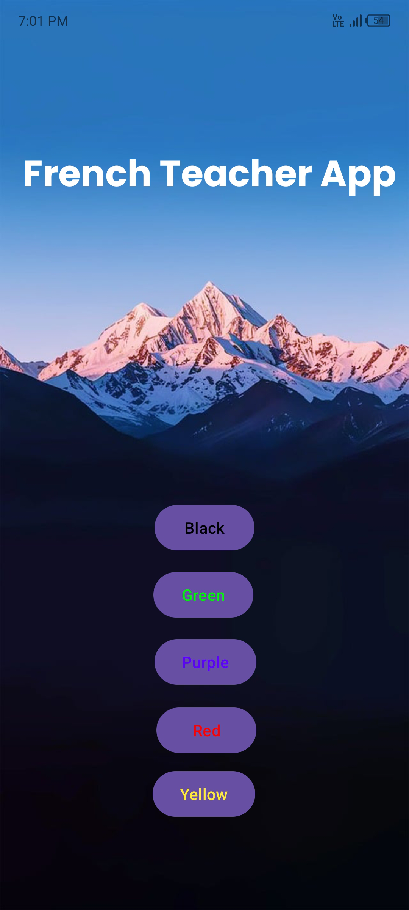

# FrenchTeacherApp
A simple Android app designed to teach users the names of colors in French. The main page features five buttons, each labeled with a different color. When a button is clicked, an audio file plays the name of the color in French. This app was created to practice using the `MediaPlayer` class in Android and handling multiple buttons.

## Features
- **Main Page:**
  - Five buttons labeled with different colors: Red, Purple, Green, Yellow, and Black.
  - Each button, when clicked, plays an audio file pronouncing the color's name in French.

## Technologies Used
- Java
- Android Studio
- MediaPlayer for audio playback
- Button event handling

## Screenshots
- **Main Page:**

  

## How to Run
1. Clone the repository: `git clone https://github.com/kaifali744/FrenchTeacherApp.git`
2. Open in Android Studio
3. Build and run on an emulator or physical device

## Connect with Me
- [Twitter](https://x.com/kaifali744)
- [LinkedIn](https://www.linkedin.com/in/mohammad-kaif-ali-3a19671a0/)
